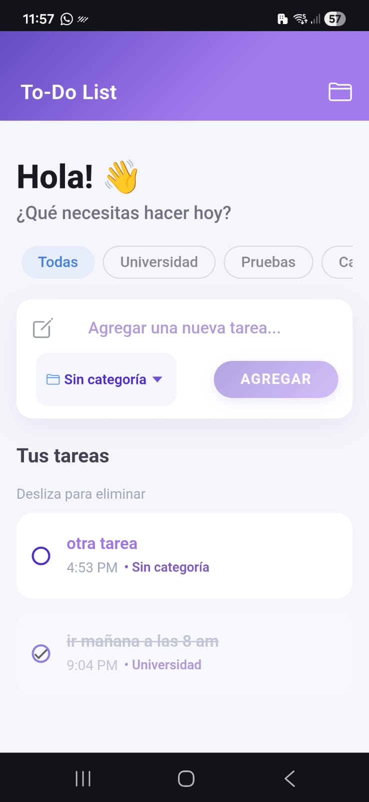
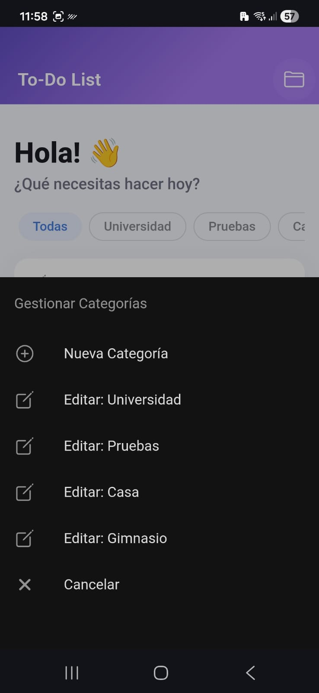
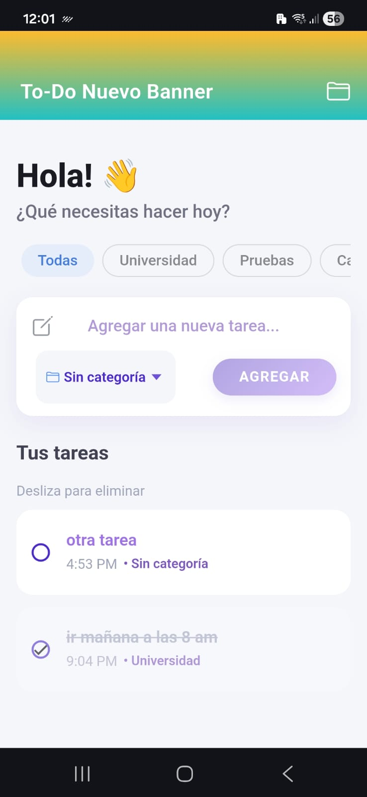

# To-Do Accenture Application 🚀

Una aplicación móvil moderna y optimizada desarrollada con **Ionic** y **Angular**, diseñada para la gestión eficiente de tareas personales con categorización avanzada y alto rendimiento.

---

## 📸 Vista de la Aplicación

| Home Screen | Categorías | Feature Flag |
| :---: | :---: | :---: |
|  |  |  |

---

## 🛠️ Tecnologías y Versiones

La aplicación utiliza un stack tecnológico para garantizar estabilidad y velocidad:

- **Ionic Framework:** ^8.0.0 (Componentes UI nativos)
- **Angular:** ^20.0.0 (Framework base)
- **Angular Signals:** Gestión de estado reactiva.
- **Angular CDK:** ^20.0.0 (Virtual Scrolling para rendimiento).
- **Cordova:** Para el puente nativo con Android e iOS.
- **Firebase:** Remote Config para gestión de Feature Flags.

---

## 🏛️ Arquitectura

La aplicación sigue una arquitectura basada en **Servicios y Signals**, priorizando la reactividad y la eficiencia de memoria.

1.  **Capa de Servicio (`TodoService`):** Centraliza la lógica de negocio y el estado global utilizando `signals` y `computed`. Esto elimina la necesidad de suscripciones manuales y previene fugas de memoria (*Memory Leaks*).
2.  **Optimización de Renderizado:** Se implementó **Virtual Scrolling** (`@angular/cdk/scrolling`) en la lista de tareas. Esto permite manejar miles de elementos en el DOM sin degradar el rendimiento del dispositivo, reciclando dinámicamente los nodos visibles.
3.  **Persistencia:** Gestión de datos locales optimizada.
4.  **Diseño Premium:** Estilos basados en Vanilla SCSS con un sistema de diseño limpio, sombras dinámicas y micro-animaciones.

---

## 🚀 Instalación y Ejecución Local

### Requisitos Previos
- Node.js (Versión LTS recomendada)
- Ionic CLI: `npm install -g @ionic/cli`

### Pasos
1. Clonar el repositorio.
2. Instalar dependencias:
   ```bash
   npm install
   ```
3. Ejecutar en el navegador:
   ```bash
   ionic serve
   ```

---

## 📱 Integración con Cordova y Builds

La aplicación utiliza Cordova para empaquetar el código web en contenedores nativos.

### Requisitos para Android
- **Android Studio** instalado.
- **Android SDK Command-line Tools (latest)** descargadas desde el SDK Manager.
- Variable de entorno `ANDROID_HOME` configurada.
- **Gradle** instalado y agregado al PATH del sistema.

### Generar Builds

#### Android (APK)
```bash
ionic cordova build android
```
El archivo resultante se encuentra en: `platforms/android/app/build/outputs/apk/debug/app-debug.apk`

#### iOS (IPA)
> [!IMPORTANT]
> Para compilar en iOS es **obligatorio** el uso de una computadora con **macOS** y tener instalado **Xcode**.

```bash
ionic cordova build ios
```
Este comando genera un proyecto de Xcode que luego debe ser firmado y compilado desde la herramienta de Apple.

---

## 🤖 Uso del Emulador de Android

Para visualizar cambios en tiempo real en un emulador mientras se desarrolla:

1. Abrir Android Studio y lanzar un Dispositivo Virtual.
2. Ejecutar el comando de Live Reload:
   ```bash
   ionic cordova run android -l --external
   ```
3. Selecciona la IP de tu red local cuando la terminal lo solicite para habilitar la conexión entre el servidor de desarrollo y el emulador.

> [!NOTE]
> Se han configurado excepciones de `cleartextTraffic` en `network_security_config.xml` para permitir la conexión HTTP del servidor de desarrollo en dispositivos Android 9+.

---

## 🚩 Firebase Remote Config & Feature Flags

Se integró **Firebase Remote Config** para permitir el control de funcionalidades en tiempo real sin necesidad de actualizar la App en la tienda.

### Feature Flag: `change_banner`
- **Descripción:** Controla dinámicamente el comportamiento o estilo del encabezado de la aplicación.
- **Servicio:** `FeatureFlagService` gestiona la inicialización de Firebase y la recuperación de valores.
- **Configuración:** Las credenciales se encuentran protegidas en los archivos `src/environments/environment.ts`.

---

## 📂 Estructura del Proyecto

- `src/app/services`: Lógica de negocio (Tasks, Categories, Feature Flags).
- `src/app/models`: Interfaces de datos.
- `src/app/home`: Componente principal de la interfaz.
- `resources/`: Íconos y Splash Screens de la aplicación.
- `config.xml`: Configuración nativa de Cordova.
